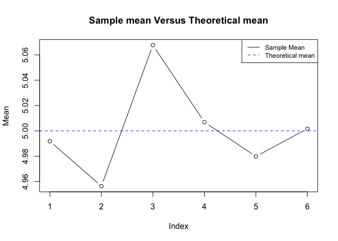
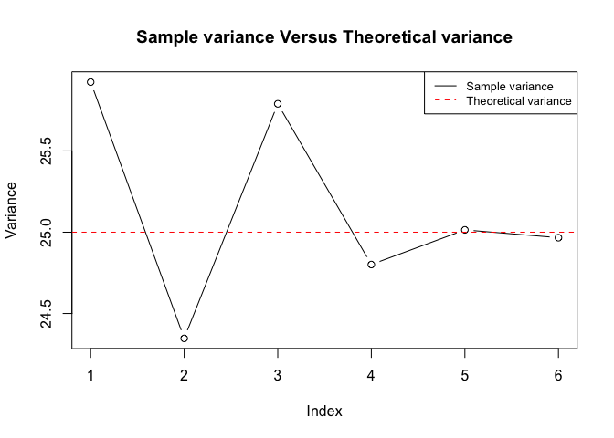
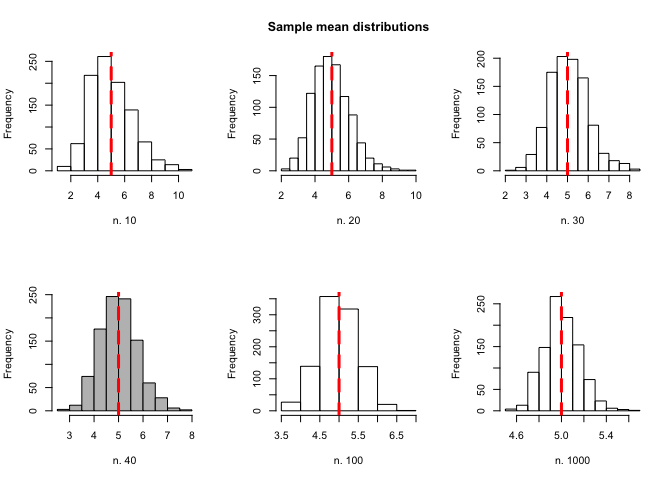
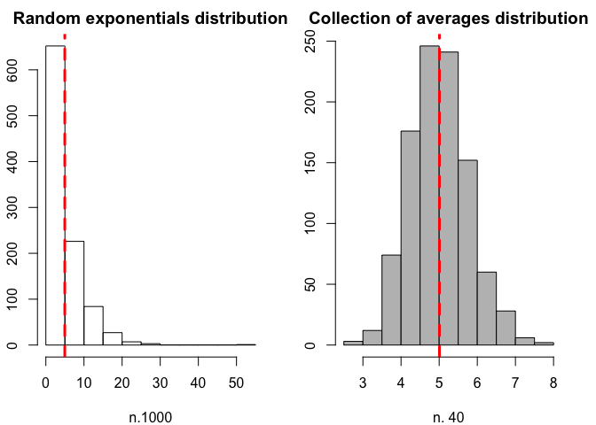

# Statistical inference Course Project
by Fabio Bianchini  
xx/05/2017  


```r
library(ggplot2)
library(datasets)
```


### Part 1: Simulation 

In this report part it will investigate the exponential distribution in R and compare it with the Central Limit Theorem. Below we see the distribution for a population with exponential caraterization. The exponential distribution with rate λ has density:

f(x) = λ {e}^{- λ x} 

The exponential distribution can be simulated in R with rexp(n, lambda) where lambda is the rate parameter. The mean of exponential distribution is 1/lambda and the standard deviation is also 1/lambda. We set lambda = 0.2 for all of the simulations. It will investigate the distribution of averages of 40 exponentials. 

##### 1 - Show the sample mean and compare it to the theoretical mean of the distribution.

We will do simulation for 6 different sample dimension.


```r
simul.num <- 1000
lambda <- 0.2
set.seed(1)

# Sample size 10
simul.data.10 = matrix(rexp(simul.num*10, lambda), nrow = 1000, ncol = 10)
mean.simul.data.10 <- apply(simul.data.10, 1, mean)
var.simul.data.10 <- apply(simul.data.10, 1, var)
# Sample size 20
simul.data.20 = matrix(rexp(simul.num*20, lambda), nrow = 1000, ncol = 20)
mean.simul.data.20 <- apply(simul.data.20, 1, mean)
var.simul.data.20 <- apply(simul.data.20, 1, var)
# Sample size 30
simul.data.30 = matrix(rexp(simul.num*30, lambda), nrow = 1000, ncol = 30)
mean.simul.data.30 <- apply(simul.data.30, 1, mean)
var.simul.data.30 <- apply(simul.data.30, 1, var)
# Sample size 40
simul.data.40 = matrix(rexp(simul.num*40, lambda), nrow = 1000, ncol = 40)
mean.simul.data.40 <- apply(simul.data.40, 1, mean)
var.simul.data.40 <- apply(simul.data.40, 1, var)
# Sample size 100
simul.data.100 = matrix(rexp(simul.num*100, lambda), nrow = 1000, ncol = 100)
mean.simul.data.100 <- apply(simul.data.100, 1, mean)
var.simul.data.100 <- apply(simul.data.100, 1, var)
# Sample size 1000
simul.data.1000 = matrix(rexp(simul.num*1000, lambda), nrow = 1000, ncol = 1000)
mean.simul.data.1000 <- apply(simul.data.1000, 1, mean)
var.simul.data.1000 <- apply(simul.data.1000, 1, var)
```


```r
means <- c(mean(mean.simul.data.10), mean(mean.simul.data.20), mean(mean.simul.data.30), mean(mean.simul.data.40), mean(mean.simul.data.100) ,mean(mean.simul.data.1000) )
means
```

```
## [1] 4.991806 4.956343 5.067634 5.006871 4.979851 5.001676
```

```r
plot(means, ylab = "Mean",main = "Sample mean Versus Theoretical mean",type="b")
abline(h=5, col="blue", lty=2) # Population Mean
legend("topright", legend=c("Sample Mean", "Theoretical mean"),
       col=c("black", "blue"), lty=1:2, cex=0.8)
```

<!-- -->

The *sample mean* converge to the *theoretical mean* if we increse the sample dimension, with n. 40 we obtain the value 
**5.01** that is very near to the **5** that is the theoretical value.

##### 2 - Show how variable the sample is (via variance) and compare it to the theoretical variance of the distribution.


```r
variation <- c(mean(var.simul.data.10), mean(var.simul.data.20), mean(var.simul.data.30), mean(var.simul.data.40), mean(var.simul.data.100) ,mean(var.simul.data.1000))
variation
```

```
## [1] 25.92365 24.34676 25.78997 24.80100 25.01419 24.96616
```

```r
plot(variation, ylab = "Variance",main = "Sample variance Versus Theoretical variance",type="b")
abline(h=(5^2), col="red", lty=2) # Population Mean
legend("topright", legend=c("Sample variance", "Theoretical variance"),
       col=c("black", "red"), lty=1:2, cex=0.8)
```

<!-- -->

The *sample variance* converge to the *theoretical variance* if we increse the sample dimension, with n. 40 we obtain the value **24.8** that is very near to the **25** that is the theoretical value.


#####3 - Show that the distribution is approximately normal

Below we compare different sample means (10, 20, 30, 40, 100 and 1000 samples) with the theoretical mean of the exponential distribution.

```r
#
par(mfrow=c(2,3))
hist(mean.simul.data.10, xlab="n. 10", main = "") 
abline(v=5, col="red", lty=2, lwd=3)
hist(mean.simul.data.20, xlab="n. 20", main = "Sample mean distributions")
abline(v=5, col="red", lty=2, lwd=3)
hist(mean.simul.data.30, xlab="n. 30", main = "")
abline(v=5, col="red", lty=2, lwd=3)
hist(mean.simul.data.40, xlab="n. 40", col = "gray",main = "")
abline(v=5, col="red", lty=2, lwd=3)
hist(mean.simul.data.100, xlab="n. 100", main = "")
abline(v=5, col="red", lty=2, lwd=3)
hist(mean.simul.data.1000, xlab= "n. 1000", main = "")
abline(v=5, col="red", lty=2, lwd=3)
```

<!-- -->

In accordance with the *Central Limit theorem*, when the sample dimension increase the sample mean distribution converge to the Gaussian one.

Now we focus on the difference between the distribution of a large collection of random exponentials and the distribution of a large collection of averages of 40 exponentials.


```r
par(mar=c(4,2.2,2,2))
par(mfrow=c(1,2))

hist(rexp(1000, lambda), main = "Random exponentials distribution", xlab = "n.1000")
abline(v=mean(rexp(1000, lambda)), col="red", lty=2, lwd=3)
hist(mean.simul.data.40, main= "Collection of averages distribution", col = "grey",xlab = "n. 40")
abline(v=mean(mean.simul.data.40), col="red", lty=2, lwd=3)
```

<!-- -->

The distribution of a large collection of averages of 40 exponential (on the right) seems to be more similar to the Gaussian than the distribution of a large collection of random exponentials one (on the left).


### Part 2: Basic Inferential Data Analysis 


```r
data("ToothGrowth")
dim(ToothGrowth)
```

```
## [1] 60  3
```

```r
names(ToothGrowth)
```

```
## [1] "len"  "supp" "dose"
```

```r
head(ToothGrowth)
```

```
##    len supp dose
## 1  4.2   VC  0.5
## 2 11.5   VC  0.5
## 3  7.3   VC  0.5
## 4  5.8   VC  0.5
## 5  6.4   VC  0.5
## 6 10.0   VC  0.5
```

```r
summary(ToothGrowth)
```

```
##       len        supp         dose      
##  Min.   : 4.20   OJ:30   Min.   :0.500  
##  1st Qu.:13.07   VC:30   1st Qu.:0.500  
##  Median :19.25           Median :1.000  
##  Mean   :18.81           Mean   :1.167  
##  3rd Qu.:25.27           3rd Qu.:2.000  
##  Max.   :33.90           Max.   :2.000
```

```r
str(ToothGrowth)
```

```
## 'data.frame':	60 obs. of  3 variables:
##  $ len : num  4.2 11.5 7.3 5.8 6.4 10 11.2 11.2 5.2 7 ...
##  $ supp: Factor w/ 2 levels "OJ","VC": 2 2 2 2 2 2 2 2 2 2 ...
##  $ dose: num  0.5 0.5 0.5 0.5 0.5 0.5 0.5 0.5 0.5 0.5 ...
```
